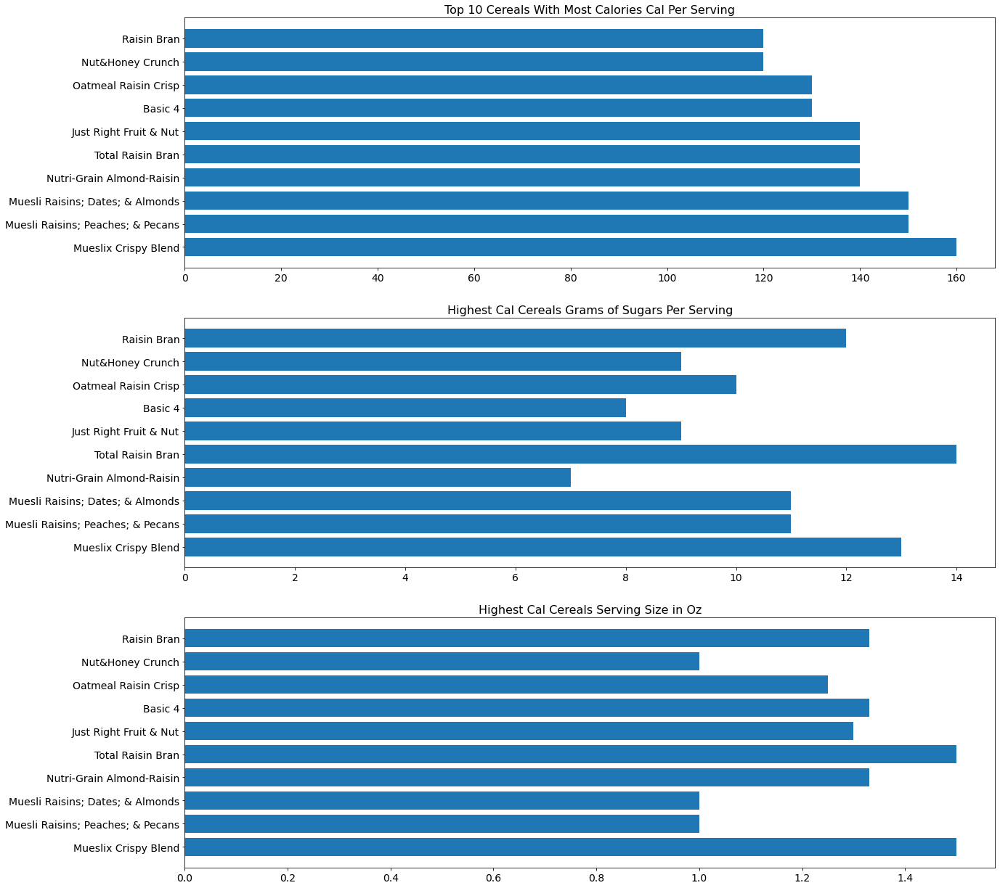
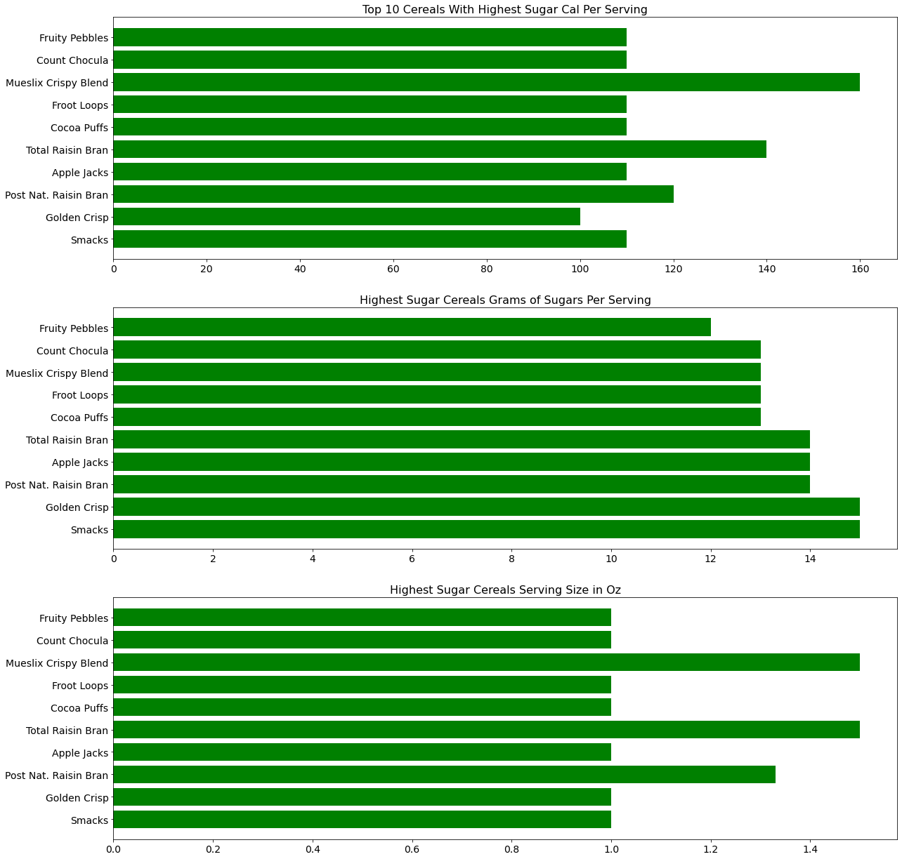
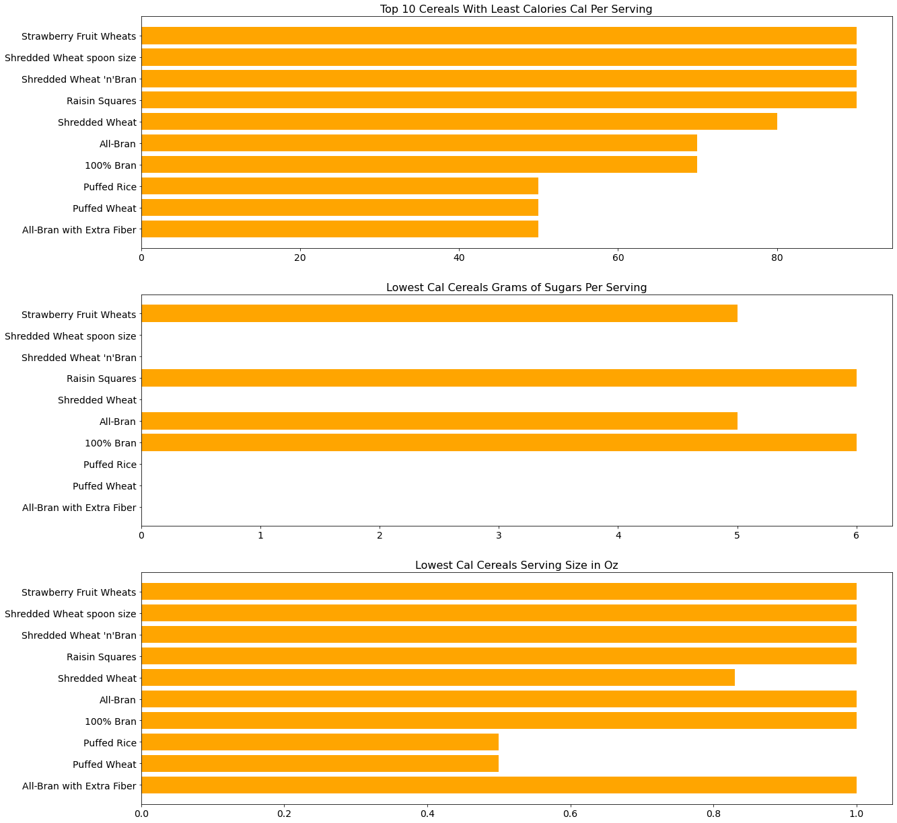

# Cereals
This is an analysis of 77 different breakfast cereals (both hot and cold) to compare the calories, grams of sugars, and the serving size.

Prior to analyzing the data, my expectation was that I would find that the cereals with the highest calories per serving would also have the highest grams of sugar per serving, but that was not the case.

As you can see in the visualization below, the top 10 cereals with the highest calories were not all in the categories with the highest grams of sugars.  Upon further review, I found that the cereals with the highest grams of sugars kept the calories lower by making the serving size 1 oz, whereas the highest calorie cereals mostly had serving sizes between 1.2 and 1.4 ounces.  The lowest calorie cereals were very comparable to the cereals with the highest sugar content in that they also had smaller serving sizes.

My conclusion from this data is that every cereal is approximately 100 calories per ounce regardless of the grams of sugars.

